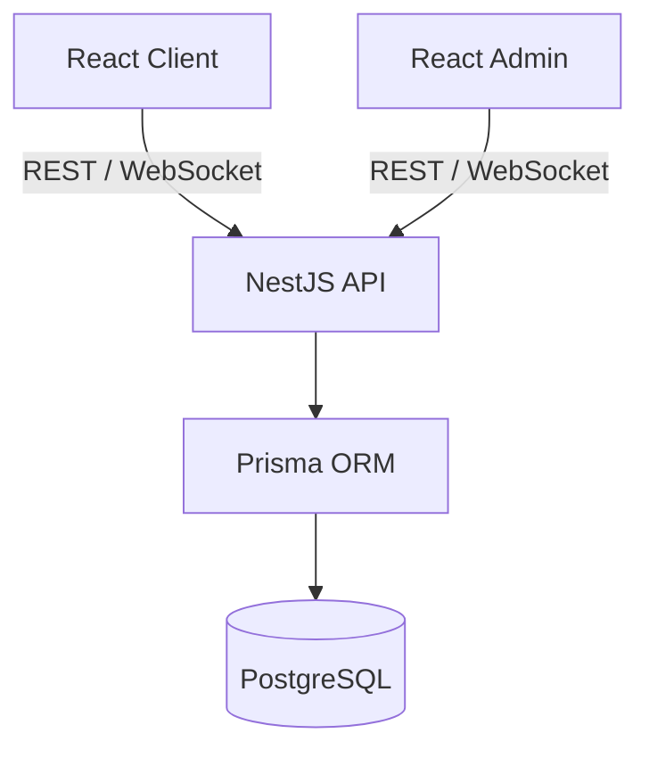

# E-Commerce Platform

A production-style starter monorepo for a five-person student team. Each ticket is a vertical feature: database -> Prisma -> NestJS -> API -> authorization -> React -> Redux Toolkit/RTK Query -> UI.

## Stack

React, Vite, TypeScript, React Router, Redux Toolkit, RTK Query, Tailwind-ready client shells, React Hook Form, Zod, NestJS, Prisma, PostgreSQL, JWT/Passport, Swagger, Socket.IO, pnpm, Docker Compose, ESLint and Prettier.

## Architecture



## Structure

- `apps/client`: customer storefront, routes, auth feature, store and RTK Query.
- `apps/admin`: protected back-office shell and placeholder feature pages.
- `apps/server`: NestJS modules, Prisma schema/seed, auth and notification gateway.
- `packages`: shared types, lint and TypeScript configuration.
- `docs`: architecture notes and vertical feature tickets.

## Setup

Prerequisites: Node 20+, pnpm 9+, Docker Desktop.

```bash
docker compose up -d
pnpm install
copy apps/server/.env.example apps/server/.env
copy apps/client/.env.example apps/client/.env
copy apps/admin/.env.example apps/admin/.env
pnpm db:migrate
pnpm db:seed
pnpm dev
```

Client: `http://localhost:5173` · Admin: `http://localhost:5174` · API: `http://localhost:3000/api` · Swagger: `http://localhost:3000/api/docs`

## Database commands

`pnpm db:migrate` creates a development migration, `pnpm db:seed` loads starter data, and `pnpm db:studio` opens Prisma Studio. The database is PostgreSQL from `docker-compose.yml`.

Seed accounts all use `Student123!`: `admin@example.com`, `student1@example.com`, and `student2@example.com`.

## Authentication

Register at `/register`, login at `/login`, then inspect the authenticated profile at `/profile`. The client stores the access token in its auth slice, sends it through RTK Query headers, and clears local state/cache on logout. The API returns safe user objects only. Admin endpoints should use `JwtAuthGuard` and `RolesGuard` with `@Roles(Role.ADMIN)`.

## Team workflow

Read [CONTRIBUTING.md](CONTRIBUTING.md) before starting. Never push directly to `main`; use `develop`, one feature branch per ticket, a PR, peer review, and instructor review.

Useful commands: `pnpm dev`, `pnpm build`, `pnpm lint`, `pnpm format`, `pnpm test`.
